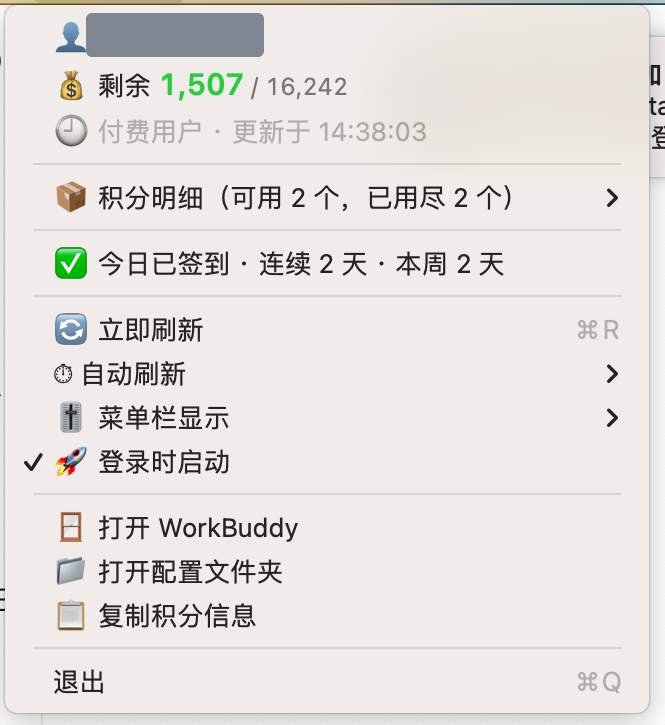

# WorkBuddy 积分状态栏小工具（macOS）

把 WorkBuddy 的积分余额直接显示在 macOS 菜单栏里，鼠标一点即可看到明细、签到状态，并支持自动刷新与登录自启。




## 特性

- **菜单栏常驻**：以 `⚡ 1507` 形式显示剩余积分，支持「数值 / 百分比 / 仅图标」三种显示模式
- **自动读取登录态**：直接复用 WorkBuddy 桌面端已登录的令牌，**无需手动填 token**，令牌刷新后自动跟随
- **积分明细**：下拉菜单展示各套餐（成长计划、奖励积分等）的剩余 / 总量 / 已用
- **签到状态**：显示今日是否签到、连续天数、本周签到天数
- **自动刷新**：可选 1 / 5 / 15 / 30 分钟，或仅手动刷新（⌘R）
- **登录时启动**：菜单内一键开关，写入用户级 LaunchAgent
- **零依赖**：纯 Swift + AppKit，编译产物约 300 KB

## 环境要求

- macOS 13 及以上（开发验证环境：macOS 13.7.8 / Intel x86_64）
- Xcode 命令行工具（`xcode-select --install`），提供 `swiftc`

## 下载安装（无需编译）

到 [Releases](https://github.com/walraven2/workbuddystatue/releases) 下载
`WorkBuddyStatus-<版本>-macos-universal.zip`（同时支持 Intel 与 Apple 芯片），然后：

```bash
unzip WorkBuddyStatus-1.2.0-macos-universal.zip
./WorkBuddyStatus.app/Contents/MacOS/WorkBuddyStatus --check   # 可选：先诊断
xattr -dr com.apple.quarantine WorkBuddyStatus.app             # 去掉隔离属性
cp -R WorkBuddyStatus.app /Applications/ && open /Applications/WorkBuddyStatus.app
```

或者解压后直接用仓库里的安装脚本：

```bash
./install.sh WorkBuddyStatus-1.2.0-macos-universal.zip   # 安装并启动
./install.sh --uninstall                                 # 卸载（含登录自启）
```

**首次打开被 Gatekeeper 拦截时**：右键 App → 打开，或执行上面的 `xattr -dr`。
原因是本地构建只做了 ad-hoc 签名，没有 Apple 开发者证书。

## 编译与安装

```bash
cd WorkBuddyStatus

./build.sh            # 仅编译当前架构，产物在 build/WorkBuddyStatus.app
./build.sh run        # 编译并运行
./build.sh install    # 编译并安装到 /Applications 后启动
./build.sh dist       # 产出 Universal 发行包 dist/WorkBuddyStatus-<版本>-macos-universal.zip
./build.sh clean      # 清理 build/ 与 dist/
```

发行包会对 x86_64 与 arm64 各编译一次再用 `lipo` 合并，最后用
`ditto -c -k --keepParent` 打包，保留符号链接与扩展属性。

首次打开若被 Gatekeeper 拦截：右键 App → 打开；或执行
`xattr -dr com.apple.quarantine /Applications/WorkBuddyStatus.app`。

## 命令行参数

| 参数 | 说明 |
| --- | --- |
| `--check` / `--diagnose` | 无界面诊断：打印账户、令牌有效期、积分明细，用于排查 |
| `--enable-login` | 开启登录自启 |
| `--disable-login` | 关闭登录自启 |
| `--auto-open-menu` | 启动后自动展开菜单（截图 / 调试用） |

诊断示例：

```bash
/Applications/WorkBuddyStatus.app/Contents/MacOS/WorkBuddyStatus --check
```

## 配置

配置文件：`~/.workbuddy-status/config.json`（菜单中可一键打开所在目录）

```json
{
  "endpoint": "https://copilot.tencent.com",
  "accessToken": "",
  "userId": "",
  "refreshInterval": 0
}
```

- `accessToken` / `userId` 留空时，自动从 WorkBuddy 桌面端读取，**通常无需填写**
- 也可用环境变量覆盖：`WORKBUDDY_ENDPOINT`、`WORKBUDDY_ACCESS_TOKEN`、`WORKBUDDY_USER_ID`

运行日志：`~/.workbuddy-status/last-error.log`

## 凭据来源

按以下顺序查找：

1. `~/.workbuddy-status/config.json` 中的 `accessToken`
2. `~/Library/Application Support/CodeBuddyExtension/Data/Public/auth/*.info`（WorkBuddy 桌面端登录信息）
3. `~/.workbuddy/auth/`、`~/.codebuddy/auth/`（兼容旧布局）

取到 JWT 后本地解析 `exp` 判断是否过期，过期会在菜单中提示重新登录。

## 数据接口

```
POST https://copilot.tencent.com/billing/meter/get-user-resource-summary
Authorization: Bearer <accessToken>
X-User-Id: <userId>
```

## 卸载

```bash
/Applications/WorkBuddyStatus.app/Contents/MacOS/WorkBuddyStatus --disable-login
rm -rf /Applications/WorkBuddyStatus.app ~/.workbuddy-status
```

## 源码结构

| 文件 | 职责 |
| --- | --- |
| `Sources/main.swift` | 应用主体：状态栏项、菜单构建、刷新调度 |
| `Sources/CreditsAPI.swift` | 积分接口客户端与数据模型 |
| `Sources/Credential.swift` | 配置读写、凭据探测与 JWT 解析 |
| `Sources/LaunchAtLogin.swift` | 登录自启（LaunchAgent） |
| `Sources/Diagnostics.swift` | `--check` 诊断输出 |
| `Resources/AppIcon.icns` | 应用图标 |
| `build.sh` | 编译 / 打包 / 签名 / 产出发行包 |
| `install.sh` | 安装 / 卸载脚本 |
| `make-release.sh` | 创建 / 更新 GitHub Release 并上传发行包（需 token） |
| `release-notes.md` | Release 说明正文，由 `make-release.sh` 读取 |
