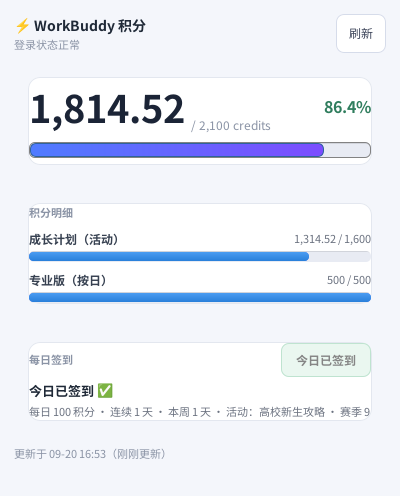

# WorkBuddy 积分 —— Linux 版

把 macOS 上那个「积分状态栏」搬到了 Linux。因为原版是 Swift/AppKit，这里是**用 Python + GTK3 重写**的，
但复用了完全一样的接口协议（`copilot.tencent.com` 的 `/billing/meter/*`），所以数据与 Mac 端一致。



## 两个东西

| 文件 | 是什么 |
|---|---|
| `workbuddy-credits.py` | **桌面小组件**（GTK3 窗口 + 托盘图标）。与桌面环境无关，XFCE/GNOME/KDE/MATE 通用 |
| `workbuddy-status.py` | 命令行 + 后台刷新服务（`daemon` / `check` / `detail` / `genmon` / `fetch`） |
| `install-credits.sh` | 装桌面小组件（程序 + 图标 + 桌面快捷方式 + 菜单项 + 托盘自启） |
| `install.sh` | 装命令行 + 刷新服务。**默认不再改面板配置**（原因见下） |

## 安装

```bash
# 1) 桌面小组件（推荐）
./install-credits.sh
#    不加 --no-desktop 会在桌面放快捷方式
#    之后双击桌面的「WorkBuddy 积分」即可

# 2) 命令行 / 后台刷新服务
./install.sh              # 不动面板
./install.sh --with-panel # 额外注册 XFCE genmon 面板插件（默认关闭，见下）

# 卸载
./install-credits.sh --uninstall
./install.sh --uninstall
```

依赖：`python3-gi`、`gir1.2-gtk-3.0`（GTK3）、`python3-pil`（画图标，可选）。

## 为什么不用面板插件（重要发现）

原本想在 XFCE 面板上用 `xfce4-genmon-plugin` 显示 `⚡1714`，**失败了**，而且原因是可复现的：

环境：`xfce4-panel 4.18.4` + `xfce4-genmon-plugin 4.1.1`（Ubuntu 24.04 arm64）。

面板上显示的是字面量占位符 **`Eaas(genmon)XXX`**（`Eaas` 是 GECOS 里的真名），
无论 `command` 写什么都一样，命令**从未被执行**。

排查过程（结论明确）：

1. `xfce4-panel --restart` 没用 → 改成 `--quit` + `pkill wrapper-2.0` 彻底重启，仍然不执行。
2. 用 `dbus-monitor` 抓 `org.xfce.Xfconf` 的完整调用（**注意要加 `stdbuf -o0`**，
   否则 dbus-monitor 写文件是块缓冲的，只能看到前 ~8KB）。
3. 结果：其它 12 个插件都在读自己的配置，例如
   `/plugins/plugin-12/command`（clock）、`/plugins/plugin-6/icon-size`（systray）……
   **而 genmon 一次 `xfconf` 都没请求过，一条都没有。**
4. 说明 `libgenmon.so` 的 `genmon_construct` 里根本没去绑定 xfconf 属性——
   与写成 `/plugins/plugin-31/command` 的路径对错无关。

社区里 `(genmon)XXX` 就是「插件接口没对上」的占位符，官方给了迁移脚本
`scripts/migrate_to_xfconf.sh`；但这台机器**连不上** `gitlab.xfce.org` / `archive.xfce.org` / `github.com`
（curl 全部返回 `000`），拿不到脚本，也就没必要继续耗。

**结论：改用桌面小组件。** 零面板配置改动，任何桌面环境都能用。

> 顺带修掉一个严重 bug：`install.sh` 原来用
> `xfconf-query -p /panels/panel-1/plugin-ids -t int -s $ID -a`
> 来「追加」插件。`xfconf-query` **没有追加数组的选项**，`-a` 只是「属性不存在时创建」，
> 对数组而言会把整个数组**覆盖**成单个元素——曾经把用户原有的 12 个插件全清空。
> 现在改成 `panel_ids_get/set/add/remove`：先读整份、再整份写回。

## 数据是怎么来的

Linux 上没有 macOS 那个 `CodeBuddyExtension/Data/Public/auth/*.info`，也没用
`state.vscdb`（里面那把 `planning-genie.new.accessTokencn` 是加密的 Buffer，取不出来）。

能用的明文 JWT 在：

```
~/.config/CodeBuddy CN/automations/automations.db   → 表 automation_runs.runs_json
```

（`"authenticated":true,"token":"<JWT>"`，另有 WAL 里未 checkpoint 的片段）

`workbuddy-status` 会把找到的所有 JWT 按 **优选指纹 → iat 新旧 → token 长度** 排序，
然后**逐个真去请求接口**，第一个成功的记下 md5 指纹存到 `~/.workbuddy-status/.token-fingerprint`。
不这样做不行：`automations.db` 里混着不少**被截断的残片**（同一个 JWT 的 1321 / 1319 / 1311 长度副本），
只靠长得像 JWT 会选中坏的那几个，接口会回 401/403。

接口（与 macOS 端一致）：

- `POST /billing/meter/get-user-resource-summary`
  头：`Authorization: Bearer <token>`、`X-User-Id: <uid>`、`Content-Type: application/json`
- `POST /billing/meter/checkin-activity-status` —— 查签到状态（`active` / `today_checked_in` / `streak_days`）
- `POST /billing/meter/daily-checkin` —— **执行签到**（见下节）

## 每日签到

窗口里那个按钮点一下就签到，托盘右键菜单里也有同一项。今天已签过时按钮变绿并置灰。

等价命令：

```bash
workbuddy-status checkin      # 输出一行 JSON，如 {"status":"ok","credit":100,"streak":2}
```

三种结果：`ok`（首次签到成功）/ `already`（今日已签，幂等，退出码仍为 0）/ `error`。

### 两个必须记住的坑

**1. 「今日已签」是用 HTTP 400 返回的。** 服务端在 4xx 响应体里塞业务码：

```json
POST /billing/meter/daily-checkin -> HTTP 400
{"code":10001,"msg":"今天已签到，请明天再来"}
```

Python 的 `urlopen` 会直接抛 `HTTPError`，如果不读 `e.read()` 就永远看不到这个 body，
会把「今日已签」误判成失败。所以签到走的是 `api_post_raw()`（不把 HTTP 状态码当结论），
再按 `code==10001` 或消息里含「已签到」判定为幂等成功。

**2. `/checkin-status` 的数据不可信。** 实测同一个账号同一时刻：

| 端点 | `active` | `today_checked_in` |
|---|---|---|
| `/billing/meter/checkin-status` | `false` | `false` |
| `/billing/meter/checkin-activity-status` | `true` | `true` |

以后者为准（它就是余额接口一直在用的那个）。

签到成功后会在 `~/.workbuddy-status/.checkin-mark` 记下当天日期作为本地兜底标记——
服务端时间跨日判定和客户端时区可能不一致，有这个就不用每次都打接口。

## 状态目录

```
~/.workbuddy-status/
├── config.json            配置（endpoint / refreshInterval / icon / mode）
├── cache.json             最新数据，GUI 和 CLI 都读这个
├── last-error.log         最近一次抓取失败的原因
├── .token-fingerprint     已选中的令牌指纹
├── .credits.lock          GUI 单实例锁
└── .show-request          再点一次桌面图标时，用它唤醒已有实例
```

`cache.json` 结构：

```json
{"ok": true, "updated_at": 1789892095, "token_expires_at": 1793753870, "is_paid": false,
 "packages": [{"code":"...","name":"成长计划（活动）","total":1500,"remain":1214.53,"used":285.47,"frozen":0,"unit":"credits"}],
 "checkin": {"active":true,"today":false,"streak":0,"daily":100,"week":0,"season":9,"activity":"高校新生攻略"},
 "total_remain": 1714.53, "total_capacity": 2000, "total_used": 285.47, "ratio": 0.8573}
```

## 用法速查

```bash
workbuddy-credits            # 打开窗口（已有实例时会唤醒它）
workbuddy-credits --tray     # 托盘常驻
workbuddy-credits --make-icon
workbuddy-status             # 诊断（等价于 check）
workbuddy-status fetch       # 抓一次并写缓存
workbuddy-status detail      # zenity 明细弹窗
workbuddy-status daemon      # 后台定时刷新
```
